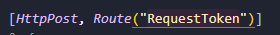

# Token 实现步骤

## **一. 安装JWT认证支持库（必须引入）**
```
dotnet add package Microsoft.AspNetCore.Authentication.JwtBearer
```

## **二. 签发Token**

**认证第一步:签发Token**

### **1. 新建Models：**
**用于接收用户输入的参数 (username,password)**
   
### **2. 新建控制器,并在控制器创建一个API方法**
```
 [HttpPost, Route("RequestToken")]
        public dynamic GetToken(UserCreate users)
        {
              //这儿待完善
            return new{};
        }
```
   
### **3. 生成JWT Token需要预设一些参数,在appsetting.json设置:**
```	
"tokenParameter": {
"secret": "123456123456123456",
"issuer": "BruseLee",
"accessExpiration": 120, // Token有效分钟数,过了这个时间，此Token会过期
"refreshExpiration": 1440  // refreshToken的有效分钟数，过了这个时间，用户需要重新登录
}
```

### **4. 新建Models目录,创建一个映射TokenParameter类。用于接收数据**

public class tokenParameter
{
    public string Secret { get; set; }
    public string Issuer { get; set; }
    public int AccessExpiration { get; set; }
    public int RefreshExpiration { get; set; }
}
	
### **5. 依赖注入**

### **6. 在控制器完成Token和refreshToken的生成和返回。**
	  
	  // 这儿是真正的生成Token代码
          private string GenUserToken(string username, string role)
        {
            var claims = new[]
            {
                new Claim(ClaimTypes.Name, username),
                new Claim(ClaimTypes.Role, role),
            };

            var key = new SymmetricSecurityKey(Encoding.UTF8.GetBytes(_tokenParameter.Secret));
            var credentials = new SigningCredentials(key, SecurityAlgorithms.HmacSha256);
            var jwtToken = new JwtSecurityToken(_tokenParameter.Issuer, null, claims, expires: DateTime.UtcNow.AddMinutes(_tokenParameter.AccessExpiration), signingCredentials: credentials);

            var token = new JwtSecurityTokenHandler().WriteToken(jwtToken);

            return token;
        }

### **7. 使用Rest Client测试**

### Token验证
**//  获取Url地址填控制器中的方法路由名称**

POST http://localhost:5000/user/RequestToken   
   

```
Content-Type: application/json

{
    "Username":"Bruselee",
    "Password": "20220123"
}
```
