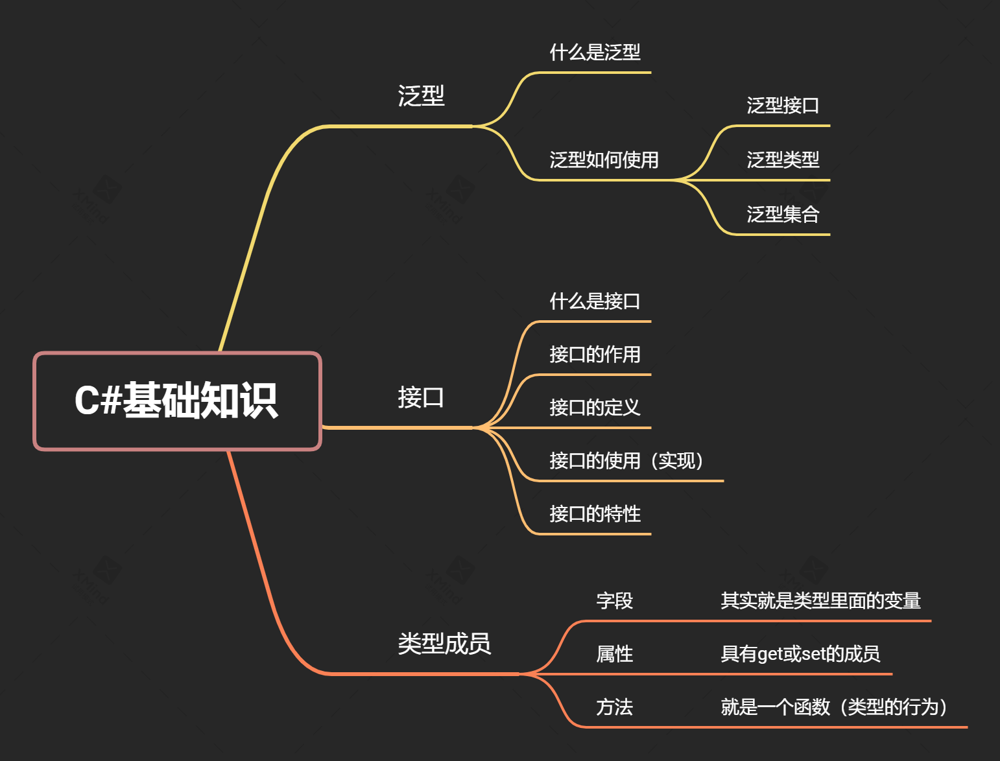

## 使用到的技术包括，但不限于如下所列：

1. 基于`asp.net core`和`netcoreapp3.1`
2. 基于`EntityFramework core`和数据迁移技术
3. SqlServer 2014 Express
4. 基于控制反转（IoC）和依赖注入技术（DI）
5. 使用Restfull约定，来分别完成数据的CRUD，类似如下用法：

    | 路由形式 | 说明 |
    | - | -|
    |    get /users  | 获取用户列表 |
    |    get /users/:id     |  获取指定id的用户 |
    |    post /users | 增加用户 |
    |    put /users/:id | 修改指定用户 |
    |    delete /users/:id | 删除指定用户 |


6. 对数据库的CRUD操作的简单封装

+ 接口
+ 泛型
+ 泛型接口
+ 泛型接口的实现
+ 集合
+ 集成查询（LINQ）
+ 异步方法
+ 任务

7. 基于webapi的路由模式
   
8. api测试工具（Rest Client）的使用

9. dotnet命令的应用（创建解决方案、创建webapi项目，将项目加入到解决方案、添加依赖包、安装依赖包、安装全局dotnet-ef工具、（根据依赖信息）下载依赖包、编译、运行）

```
dotnet new sln -n Admin3000.Backend
dotnet new webapi -n Admin3000.Backend.Api --no-https
dotnet sln add Admin3000.Backend.Api
cd Admin3000.Backend.Api
dotnet add package Microsoft.EntityFrameworkCore
dotnet add package Microsoft.EntityFrameworkCore.SqlServer
dotnet tool install --global dotnet-ef
dotnet add package Microsoft.EntityFrameWorkCore.Design
(定义实体模型、定义数据库上下文，定义连接字符串)
dotnet ef migrations add XXX
dotnet ef database update
```

10. 回顾了一些C#的基础知识，如下图：



